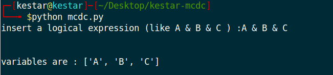
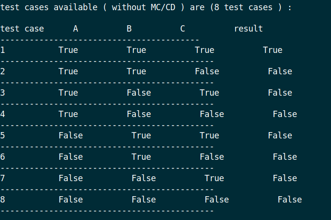
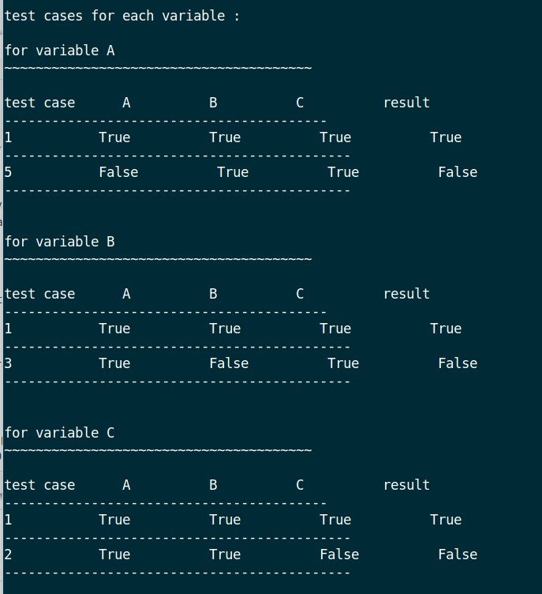
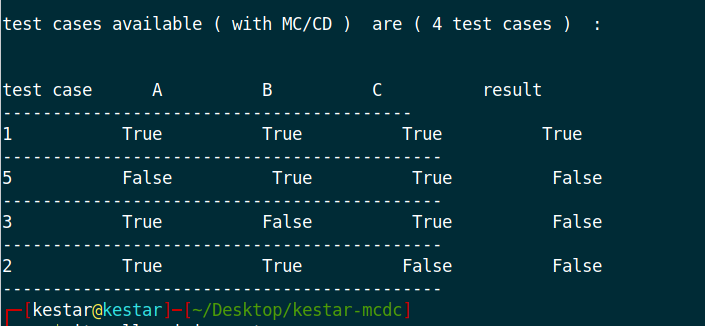

# kestar-mcdc

MC/DC (Modified Condition/Decision Coverage) is a software testing strategy for highly critical systems.

and the kestar-mcdc python script is here to generate MC/DC test cases fo you to achieve the 100% MC/DC coverage.

after running the script you should insert your logical expression for example : A & B & C 

the script will generate all the test cases (NOT only MC/DC ) :

after that the script shows you the test cases that you must do for each part of your logical expression  : 

finally the script will show you only the test cases that you have to do to achieve the 100% MC/DC test coverage.

enjoy it ! in case if you have any issue please added it in the issues part !

